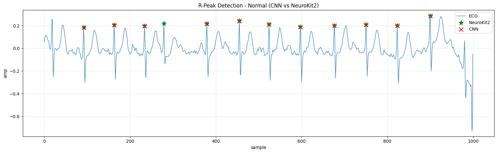

# Deep-Leaning-ECG-PTBX
# ECG Signal Analysis: Normal vs Myocardial Infarction Classification

**Visual Pattern Recognition for ECG**  
**Author:** Mohammad Bdaqli  
**Date:** November 2024

---

## Project Overview

This project addresses visual pattern recognition challenges in ECG signal analysis, specifically focusing on distinguishing between Normal and Myocardial Infarction (MI) patients using the PTB-XL ECG database. The study implements a comprehensive pipeline for R-peak detection, morphology annotation, and pathological pattern visualization.

## Research Questions

This project investigates three critical research questions:

1. **R-Peak Identification**: How can we accurately identify R peaks in both normal and MI patients?
2. **Morphology Annotation**: Once R peaks are identified, how can we detect and annotate other morphological features (P-wave, QRS complex, T-wave)?
3. **Pathological Visualization**: How can we visualize and compare deformed MI morphology against normal baseline patterns?

## Dataset

**Source:** [PTB-XL ECG Dataset on Kaggle](https://www.kaggle.com/datasets/khyeh0719/ptb-xl-dataset/versions/1)

**Dataset Characteristics:**
- **Normal ECG:** 9,528 samples
- **MI (Myocardial Infarction):** 5,486 samples
- **Sampling Rate:** 100 Hz
- **Signal Length:** 10 seconds
- **Leads:** 12-lead ECG recordings

> **Note:** This version differs slightly from the latest PhysioNet version (9,514 Normal, 5,469 MI) due to availability and download speed considerations.

## Methodology

### Phase 1: Signal Processing & Morphology Detection
- **Tool:** NeuroKit2 (specialized biosignal analysis toolkit)
- **Lead Selection:** Lead II (optimal for R-peak discrimination)
- **Signal Processing:**
  - Noise removal using `nk.ecg_clean()`
  - R-peak detection using `nk.ecg_peaks()` (NeuroKit method for local maxima in QRS complexes)
  - Morphology delineation using `nk.ecg_delineate()` with timing-based rules:
    - **P-waves:** 240-80ms before R-peak
    - **QRS complexes:** 40ms before to 80ms after R-peak
    - **T-waves:** 100-400ms after R-peak

### Phase 2: Binary Classification Model
- **Architecture:** CNN-LSTM hybrid model
- **Task:** Binary classification (Normal vs MI)
- **Training:** Supervised learning on labeled PTB-XL data
- **Evaluation:** Confusion matrix, accuracy, precision, recall, F1-score

### Phase 3: Neural Network for R-Peak Detection
- **Architecture:** CNN model
- **Training Data:** R-peaks detected by NeuroKit2 (used as ground truth labels)
- **Process:**
  1. CNN learns to detect R-peaks
  2. NeuroKit2 performs subsequent morphology annotation (P-peaks, QRS onsets/offsets, T-peaks)
- **Validation:** Comparison between CNN predictions and NeuroKit2 baseline

## Key Findings

### 1. R-Peak Detection
- NeuroKit2 provides robust baseline detection for both Normal and MI patients
- CNN model successfully learns R-peak patterns with high accuracy
- Some challenging samples exhibit detection failures requiring careful validation

### 2. Morphology Annotation
- Timing-based rules effectively capture morphological features
- Discrete wavelet transform method showed limitations (fallback method used)
- Annotations align well with expected cardiac cycle phases

### 3. Morphological Differences (Normal vs MI)

**Observations:**
- **Normal ECG:** Maintains consistent morphology across cardiac cycles
- **MI ECG:** Exhibits heterogeneous patterns reflecting irregular electrical activity
- **ST-T Segment:** Shows pronounced differences, key electrocardiographic markers of MI
- **Difference Signal (MI - Normal):** Clearly highlights pathological changes

**Visualization Approach:**
- Extracted individual heartbeat windows (500ms before to 1000ms after R-peak)
- Computed beat-averaged waveforms with standard deviations
- Generated difference signals to emphasize pathological deviations

## Technologies Used

**Core Libraries:**
- **NeuroKit2:** ECG signal processing and morphology detection
- **TensorFlow/Keras:** Deep learning model development
- **NumPy & Pandas:** Data manipulation and analysis
- **Matplotlib & Seaborn:** Visualization
- **WFDB:** PTB-XL dataset loading
- **SciPy:** Signal filtering and processing

**Development Environment:**
- **Platform:** Kaggle Notebooks
- **Language:** Python 3.x
- **Hardware:** GPU-accelerated training

## Results Visualization

The project generates comprehensive visualizations, including:

1. **R-Peak Detection Plots:** Identified R-peaks overlaid on ECG signals for Normal and MI samples
2. **Morphology Annotation Plots:** Full ECG waveforms with annotated P-waves, QRS complexes, and T-waves
3. **Individual Heartbeat Comparison:** Side-by-side comparison of 3 Normal vs 3 MI heartbeats
4. **Average Heartbeat Analysis:** Beat-averaged waveforms with confidence intervals (standard deviation)
5. **Morphological Difference Plot:** Difference signal (MI - Normal) highlighting pathological changes
6. **CNN vs NeuroKit2 Comparison:** R-peak detection performance evaluation

## How to Run

### Prerequisites
```bash
pip install neurokit2 tensorflow pandas numpy matplotlib seaborn wfdb scipy scikit-learn tqdm
```

### Dataset Setup
1. Download the PTB-XL dataset from [Kaggle](https://www.kaggle.com/datasets/khyeh0719/ptb-xl-dataset/versions/1)
2. Extract to your working directory

### Running the Analysis

**Option 1: Run on Kaggle (Recommended)**
- Upload the notebook to Kaggle
- Add the PTB-XL dataset
- Run all cells

**Option 2: Run Locally**
```bash
python ecg_analysis.py
```


The methodology emphasizes practical implementation while maintaining rigorous scientific standards expected in biomedical signal processing research.

## Challenges & Solutions

**Challenge 1:** Some PTB-XL records had unexpected formats, causing reshape errors
- **Solution:** Implemented robust error handling and data validation

**Challenge 2:** Discrete wavelet transform delineation method failed
- **Solution:** Successfully used timing-based fallback method with physiologically-grounded rules

**Challenge 3:** Some samples exhibited ambiguous morphology
- **Solution:** Multiple sampling iterations to select representative examples

## References

1. Wagner, P., et al. (2020). PTB-XL, a large publicly available electrocardiography dataset. *Scientific Data*, 7(1), 154.
2. NeuroKit2: A Python Toolbox for Neurophysiological Signal Processing
3. PhysioNet: PTB-XL ECG Database - https://physionet.org/content/ptb-xl/

---

